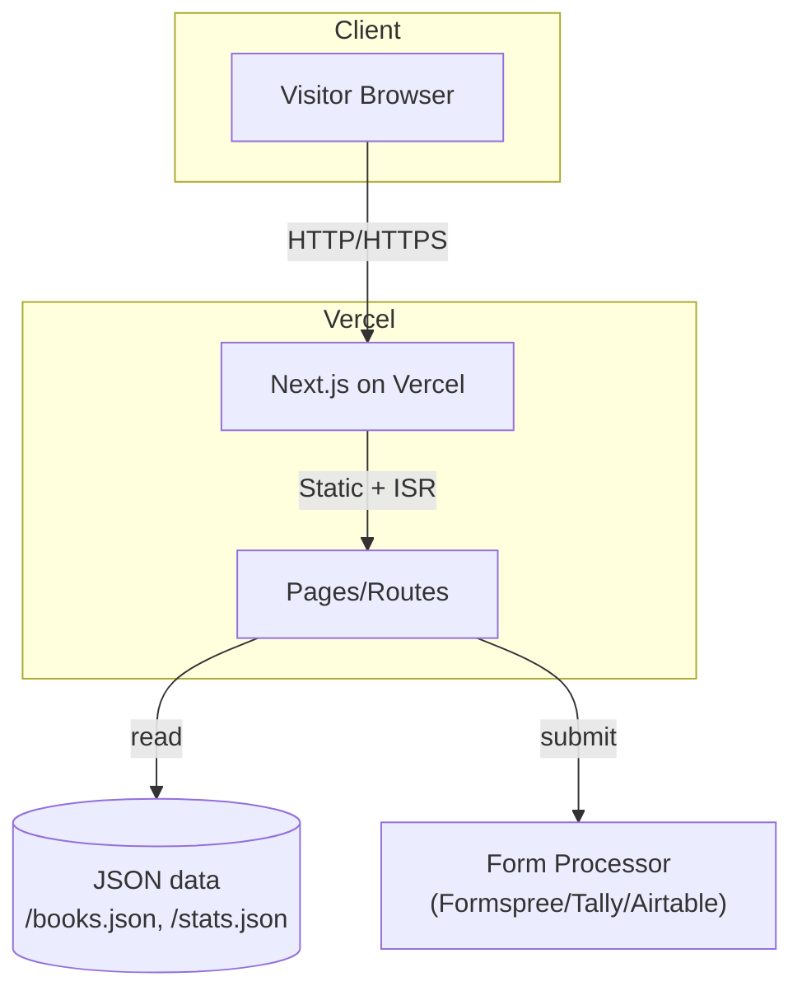
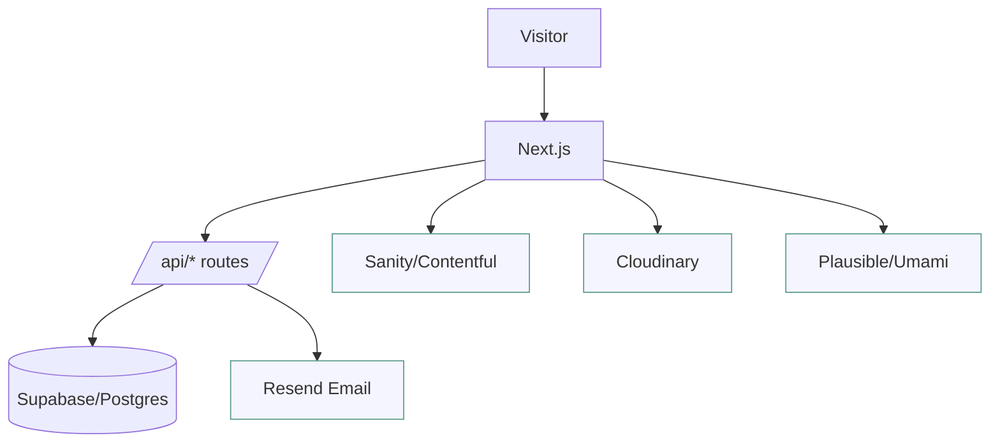
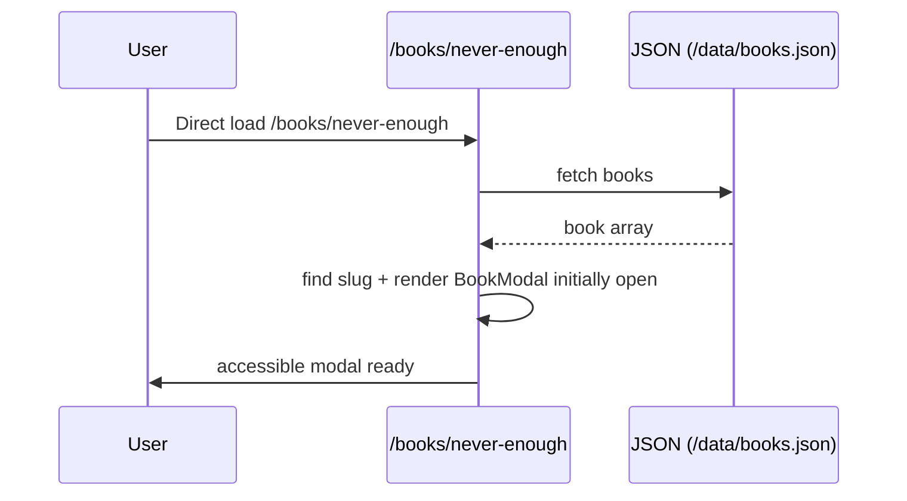
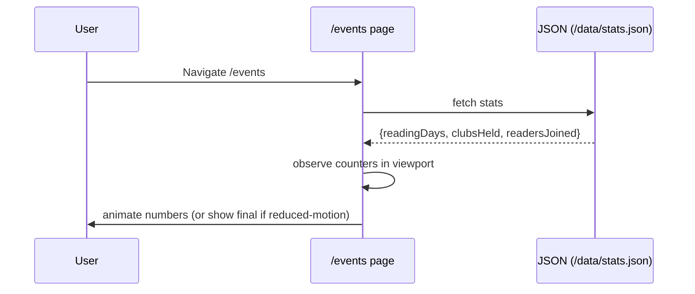
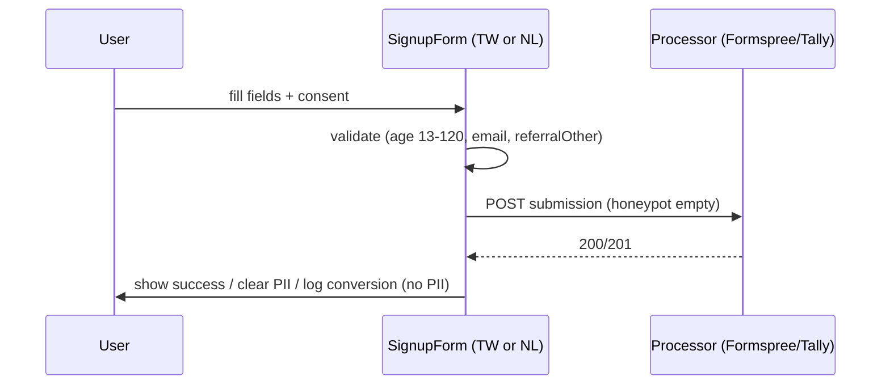
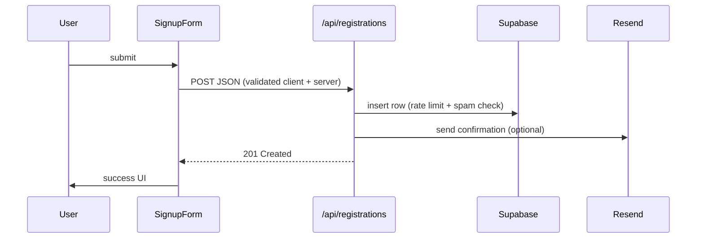

# Book Digest — Technical Design

Version: 0.1 (2025-09-02)
Owner: Engineering
References: docs/requirements.md

## 1. Overview
Purpose: Translate EARS requirements into a pragmatic, evolvable architecture that ships fast (Phase 1) and scales (Phase 2).

Key priorities
- Fast UI validation with minimal backend.
- Strong accessibility and performance from day one.
- Clear migration path to CMS/DB without rewrites.

## 2. Architecture
Two-phase approach.

### 2.1 Phase 1 (Fast UI validation)
- Framework: Next.js (App Router) + React + Tailwind CSS.
- i18n: next-intl (file-based).
- Data: Local JSON files (`/data/books.json`, `/data/stats.json`).
- Forms: External form processor (Formspree/Tally/Airtable) or a minimal serverless endpoint.
- Hosting: Vercel (preview on PR).



### 2.2 Phase 2 (Production completeness)
- Content: Sanity/Contentful CMS or Supabase Postgres.
- Forms: Next.js API routes persisting to DB; email via Resend; optional hCaptcha.
- Media: Cloudinary for transforms and caching.
- Analytics: Plausible/Umami; Error tracking: Sentry.



## 3. Pages, Components, Responsibilities
- Home: Hero (copy + scrapbook image), CTAs to Events/Detox, Why Us.
- Books: Responsive grid of cards; BookModal (deep-linkable via `/books/{slug}`).
- Events: Counters (IntersectionObserver + animation), TW/NL sign-up forms (one required).
- About: Story and Why Us blocks.
- Global: Header (nav + language switch), Footer (Podcast/Instagram/Email/Contact), Layout.

Core components
- `BookCard`: cover, title, author, date; opens modal.
- `BookModal`: focus trap, Esc/overlay close, deep-link awareness.
- `BookCarousel`: Book carousel showing 5 at a time; navigation arrows and pagination dots; sorted by readDate descending.
- `BookArticleSidebar`: Right sidebar for book article pages with Podcast links, article list, social links.
- `PageFlipAnimation`: Page flip animation with 3D transform; supports autoplay and reduced-motion.
- `SectionDivider`: White line separator between sections; customizable color and thickness.
- `Counter`: animated integer counter with reduced-motion support.
- `SignupForm`: location-aware (TW|NL), validation, honeypot, submission state.
- `LangToggle`: next-intl integration, route-preserving switch.

## 4. Routing (Next.js App Router)
- `/` → Home
- `/books` → Grid; modal opened via search param or parallel route.
- `/books/[slug]` → Full book article page (white background, sidebar, Reading Outpost style layout).
- `/events` → Counters + forms; supports `?event=TW|NL` to filter single event.
- `/about` → Story
- `/contact`, `/terms`, `/privacy`
- Locales: `/en/*`, `/zh/*` (Phase 2 locale routes; Phase 1 can use query/state)

## 5. Data Flow and Sequence Diagrams

### 5.1 Books grid load and modal open
```mermaid
sequenceDiagram
  participant U as User
  participant B as /books page
  participant D as JSON (/data/books.json)

  U->>B: Navigate /books
  B->>D: fetch book list (static import or fetch)
  D-->>B: book array
  B->>U: render grid + skeleton removal
  U->>B: click BookCard (slug)
  B->>B: set URL (/books/slug) + open BookModal
  B->>U: focus trapped in modal; Esc/overlay to close
```

### 5.2 Deep link to book modal


### 5.3 Events counters animation


### 5.4 Form submission (Phase 1 external)


### 5.5 Form submission (Phase 2 custom)


## 6. Data Models (TypeScript)
```ts
export type Book = {
  id: string;
  slug: string;
  title: string;
  author: string;
  coverUrl?: string;
  readDate?: string; // ISO date
  summary?: string;
  tags?: string[];
  links?: { publisher?: string; notes?: string };
  locale?: 'en' | 'zh'; // optional per-book locale
};

export type EventStats = {
  readingDays: number;
  clubsHeld: number;
  readersJoined: number;
};

export type Registration = {
  location: 'TW' | 'NL';
  firstName: string;
  lastName: string;
  age: number;
  profession: string;
  email: string;
  instagram?: string;
  referral: 'Instagram' | 'Facebook' | 'Others';
  referralOther?: string;
  consent: boolean;
};
```

## 7. Interfaces (APIs)
### Phase 1
- External form endpoint accepts standard fields and returns 200/201 on success.
- Optional lightweight `/api/ping` for health checks.

### Phase 2
- `POST /api/registrations` → 201
  - Body: `Registration` + `userAgent`, `referer`.
  - Validations: age 13–120, email RFC 5322 (relaxed), conditional referralOther.
  - Security: rate limit by IP (e.g., 30/min), honeypot, optional hCaptcha.
- `GET /api/books` → paginated books (if/when CMS/DB backs the list).

## 8. i18n Strategy
- Library: `next-intl` (v3.19+) with message files: `/messages/en.json`, `/messages/zh.json`.
- Configuration:
  - Server-side: `lib/i18n.ts` with `getRequestConfig` for locale detection
  - Client-side: `lib/useLocale.ts` hook for reading current locale
  - Plugin: `next.config.mjs` with `createNextIntlPlugin`
- Language persistence: Cookie (`locale`) with Accept-Language header fallback.
- Language toggle: `components/LangToggle.tsx` integrated into Header.
- Translation coverage: nav, home, whyUs, events, books, about, footer, form, modal, sidebar.
- Keep slugs language-agnostic; provide localized fields where needed.

## 8.1 SEO Strategy
- Centralized configuration: `lib/seo.ts` with `defaultSEO` and per-page `pageSEO` objects.
- Metadata includes: title, description, keywords, Open Graph, Twitter Cards.
- Dynamic SEO: `generateBookSEO(book)` function for book pages.
- Assets:
  - `public/robots.txt` - crawler guidance
  - `public/site.webmanifest` - PWA support with icons
  - `app/sitemap.ts` - dynamic sitemap generation
- Open Graph images: default `/og-image.png` with per-page overrides.
- Meta robots: index,follow for public pages; noindex for utility pages.

## 9. Accessibility
- Modal: aria-modal, role="dialog", focus trap, return focus on close.
- Keyboard: all controls reachable; visible focus outline.
- Motion: respect `prefers-reduced-motion`.
- Color contrast ≥ 4.5:1; alt text for all images; labels and descriptions for inputs.
- Announce async states via `aria-live` (form errors/success).

## 10. Error Handling & Empty States
- Network error fetching books/stats → friendly message + retry.
- Empty books → curated empty-state with contact link.
- Form errors → inline and region-level announcement; server error fallback to `mailto:` link.

## 11. Performance & Caching
- `next/image` with responsive sizes; lazy loading off-screen images.
- Preload hero fonts; compress SVG logo; use static import for JSON in Phase 1.
- Cache-control headers on images; CDN via Vercel.
- Lighthouse targets: Perf ≥ 85; keep CLS ≤ 0.1.

## 12. Security & Privacy
- Input sanitization on API; encode outbound HTML.
- Rate limiting on API routes; bot honeypot on forms.
- Content Security Policy (CSP) tuned for analytics and images.
- Analytics without PII; avoid sending personal data to third parties.

## 13. Testing Strategy
- Unit: Vitest + React Testing Library.
  - BookCard renders fallback image
  - BookModal focus-trap and deep-link open
  - Counter animates or skips on reduced-motion
  - SignupForm validations and honeypot logic
- a11y: jest-axe on core pages/components.
- E2E: Playwright for critical flows (open modal via deep link, submit TW form, counters once-per-view).
- Visual regression: Playwright snapshots for key breakpoints.

## 14. Analytics & Observability
- Plausible/Umami pageviews and custom events (form submit success). No PII.
- Sentry for client error tracking (Phase 2).

## 15. CI/CD
- Vercel preview deployments from PRs.
- Optional GitHub Actions: lint, typecheck, unit tests on PR; block on failures.

## 16. Config & Secrets
- `.env.local` (never commit):
  - `FORMS_ENDPOINT_TW`, `FORMS_ENDPOINT_NL`
  - `PLAUSIBLE_DOMAIN`/`UMAMI_WEBSITE_ID`
  - Phase 2: `DATABASE_URL`, `RESEND_API_KEY`, `SENTRY_DSN`, `HCAPTCHA_KEYS`

## 17. Suggested Folder Structure
```
app/
  layout.tsx
  page.tsx
  books/
    page.tsx
    [slug]/page.tsx   # optional if using route for deep-link modal
  events/page.tsx
  about/page.tsx
  contact/page.tsx
components/
  BookCard.tsx
  BookModal.tsx
  Counter.tsx
  SignupForm.tsx
  LangToggle.tsx
  ...
lib/
  i18n/
  analytics.ts
  validation.ts
  fetchers.ts
messages/
  en.json
  zh.json
data/
  books.json
  stats.json
public/
  images/book-covers/*
```

## 18. Implementation Notes
- Use parallel routes or search params for modal deep-linking on `/books`.
- IntersectionObserver to start counters only once when visible ≥ 50%.
- Keep forms controlled with Zod schema for client validation; mirror on server in Phase 2.
- Add a hidden honeypot input; reject if filled; delay response slightly to deter bots.
- Respect `revalidate` (ISR) when moving to CMS.

## 19. Risks & Mitigations (delta from PRD)
- Form spam spikes → add hCaptcha or rate limits sooner.
- Image licensing/hosting → standardize via Cloudinary in Phase 2.
- Content bilingual parity → fall back to default language per field.

## 20. Milestones
- M1: Phase 1 UI complete (Home/Books/Events/About), external forms wired, analytics.
- M2: Accessibility polish, i18n complete, Lighthouse targets met.
- M3: Phase 2 data migration (CMS/DB), custom API + email, Sentry.
